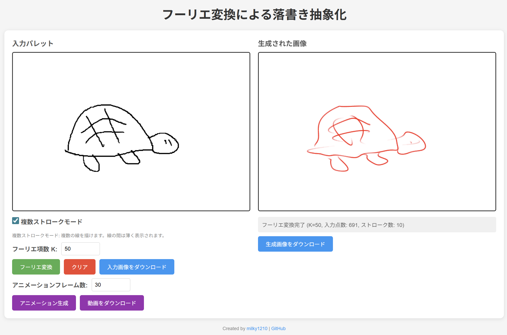

# FourierPicture

落書きをフーリエ変換で抽象化するWebアプリ

👉 **[デモを試す](https://milky1210.github.io/FourierPicture/)**



## 特徴

| 機能 | 説明 |
|------|------|
| 🎨 複数ストローク | 複数の線を描いて一つの絵に |
| 🔄 フーリエ変換 | 指定した項数(K)で再構成 |
| 🎬 アニメーション | K=2から徐々に項数を増やして再構成過程を可視化 |
| 📹 動画出力 | WebM形式で保存可能 |
| 📱 モバイル対応 | タッチ操作に対応 |

## 使い方

1. 左のキャンバスに絵を描く
2. フーリエ項数(K)を設定
3. 「フーリエ変換」または「アニメーション生成」をクリック
4. 右のキャンバスに再構成された絵が表示される

## 仕組み

描いた点列を複素数 $z = x + iy$ として離散フーリエ変換(DFT)し、振幅の大きい上位K個の周波数成分のみで再構成します。Kが小さいほど抽象的な形になり、大きくすると元の絵に近づきます。

詳しい数学的背景は [技術資料 (TECHNICAL.md)](TECHNICAL.md) を参照してください。

## ローカルで実行

```
git clone https://github.com/milky1210/FourierPicture.git
```

`docs/index.html` をブラウザで開くだけで動作します。

## ライセンス

MIT License